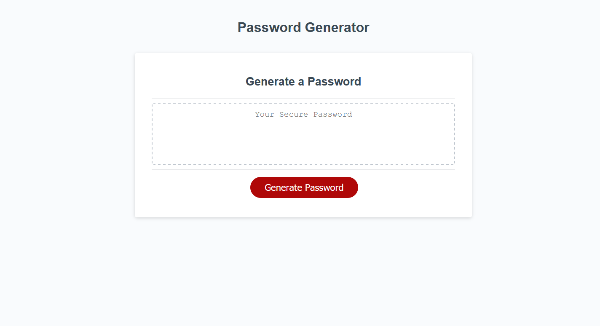

# password-generator

## Project links 
- code link https://github.com/ktlnn/password-generator
- webpage link https://ktlnn.github.io/password-generator/

## User Story
``` 
AS A user who has sensitive material on webpage accounts
I WANT to generate a random password 
SO THAT I can keep my account secured 
```

## Business Context 
Social media users, email users, and just about anyone who has any form of an account online, are being hacked. If these users were able to generate a random password, then their account would become more secured. 

## How Random Passord Generator Works
- In this project, I created a random password generator mainly using javascript. 
- I implemented loops (for and while), if/else statements, prompts, and confirms. 
- The password generator works by first clicking the "Generate Password" button. 
    - Then the user will be prompted to choose the length.
    - The user will be asked if they would like to include: lowercase letters, uppercase letters, numbers, and/or special characters. 
    - The password will then be displayed onto the page. 

## Project Screenshot 


## Questions 
If you have any questions about the project, feel free to email: ktlnn.nguyen@gmail.com
